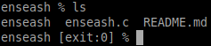

# TP de Synthèse – Ensea in the Shell

## Etudiants
* Anass HILMI
* Nicolas HAAS

## TP1
### 1. Affichage d’un message d’accueil, suivi d’un prompt simple.
This code displays the shell start message, then loops what the user enters.
We use STDOUT_FILENO to write to the console.

### 2. Exécution de la commande saisie et retour au prompt (REPL : read–eval–print loop)
This code allows you to create a child process that will execute the command, then return control to the parent who will have waited for the end of the child process.
We see that we can execute any command. Here we execute "fortune" and "ls".

### 3. Gestion de la sortie du shell avec la commande “exit” ou un <ctrl>+d
We added the ability to close the shell by tapping the "exit" command.

### 4. Affichage du code de retour (ou du signal) de la commande précédente dans le prompt
Since the parent is waiting for the child process to finish, we just need to put after this wait a program to display the child's return code. This is what we need below.

### 5. Mesure du temps d’exécution de la commande en utilisant l’appel clock_gettime :
We have taken the difference of the time before and after the execution of the child process. Which gives us the execution time to display.

Modified son code, because the code after execlp will be executed only if the command does not exist.

